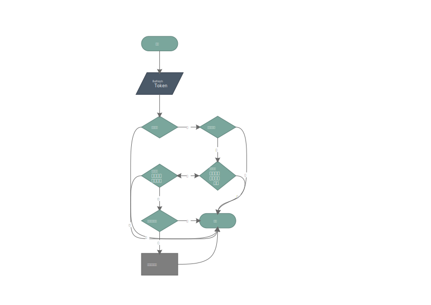

## 认证流程说明
###  流程图

### 在以下情况需要使 refresh_token 失效：
1. 用户退出登录
2. 用户修改密码
3. 用户被管理员禁用
### 解决策略：
1,2 在操作完成后将refresh_token加入黑名单 >>>>>>>> 在没有Redis的情况下使用 mysql 数据库存储
3 有两种实现方式：1) 禁用黑名单 2) 每次都查用户表，由于是对原有程序的扩展，方便起见使用第二和方式
### 认证流程：
1. 检验令牌有效
2. 令牌是否在黑名单外	//查询 refresh_token 表
3. 令牌生成上期是否在用户退出后发放，与令牌发放时间对比	//查询 user 表
4. 检测用户修改密码时间，与令牌发放时间对比	//查询 user 表
5. 检测用户未被禁用	// 查询 user 表
6. 以上条件都满足，发放新的令牌